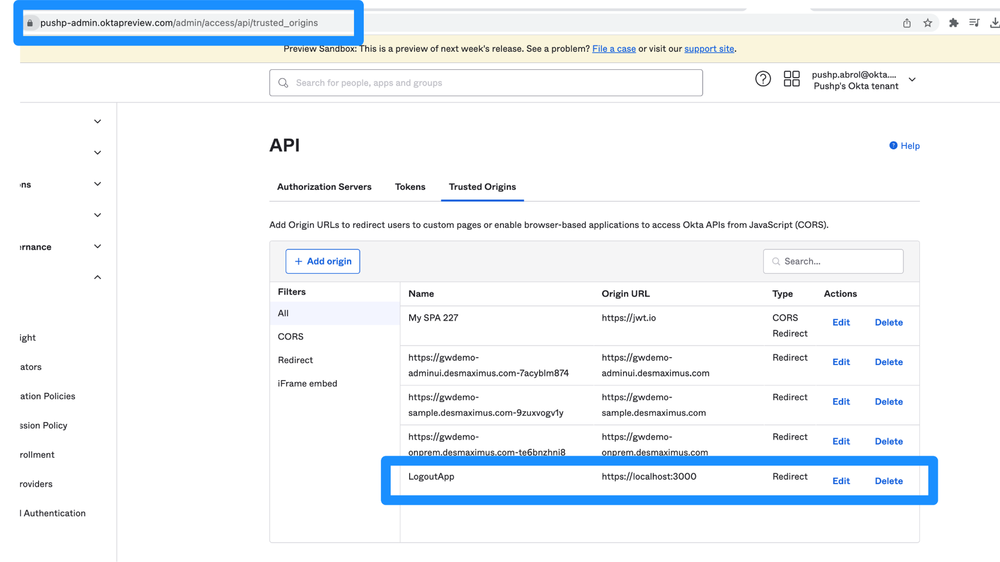
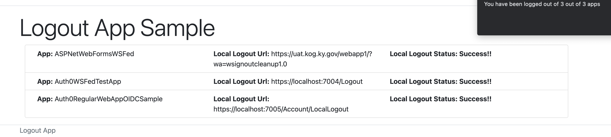
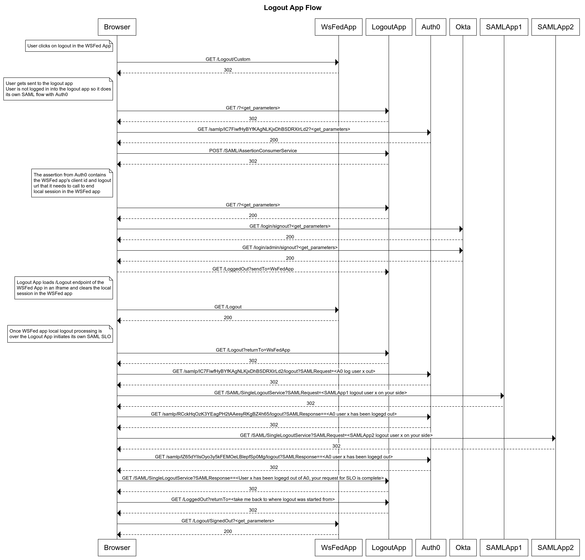

# Logout Custom Solution

-   A lightweight application  (**Logout Application**) that takes care of the WS-Federation SLO & any custom applications that require a direct call to end local session.

    -   This application is registered in Auth0 as a Regular Web
        -   Application with SAML protocol/addon enabled

    -   All applications redirect to the **Logout Application** upon logout (not to Auth0)

-   The **Logout Application**:

    -   Is setup as a SAML application within Auth0. 
    -   When user accesses this application the application will first
        -   Using Rules/Actions, add all of the WS-Federation clients and any clients that require a custom logout,  call via an iFrame to an endpoint within the application to end the local session, into the **SAML Assertions** as a custom claim. The code for this rule is within the rule **rule-add-session-clients-with-metadata.js**
    -   Next, it will call the logout endpoint of the upstream IDP that is configured within Auth0. This IDP exposes an end session/logout endpoint that when called terminates the session and allows redirect back to the appliction. 
        -   In this case since the upstream IDP is Okta we have configured Okta to allow a redirect from the Logout App. See image below:

        -   https://{okta_domain}/login/signout?fromURI=<URL of the Logout App logged out page?fromOkta=\<url of the app that initiated the logout\>\>

        

        -   This allows the logout app to redirect to Okta for logout and return back to the logout app post logout with the fromOkta param containing the url of the actual app that initiated this logout flow and the logout app redirects to the initiating app at the end

    -   Next, it will perform a WS-Federation SLO or custom logout calls to all of the clients listed in the **Custom Assertion** (filter the clients to only match WS-Federation clients and such clients needing custom logout - Client Metadata can also be used to further filter on specific clients)
        -   This step could look like this:

        
    -   Next, it will redirect to Auth0 to perform a SAML SLO

        -   When the user is redirect to Auth0, it will:

        -   Perform SAML Single Logout with all of the SAML applications the user signed into

        -   Perform OIDC Back-channel Logout with all of the OIDC applications the user signed into. At the time of writing of this sample this functionality was not yet available within Auth0
        -   Delete the Auth0 session

        -   Return the user back to the Logout Application's post logout url, so that it can continue further processing
    -   Next, the user gets sent back to the logged out page of the application that initiated the logout sequence

    - Sequence Diagram showing a successful logout flow involving **1 WS Fed App** and **2 SAML Apps** using this **Logout App** for orchestrating the full flow.

    

